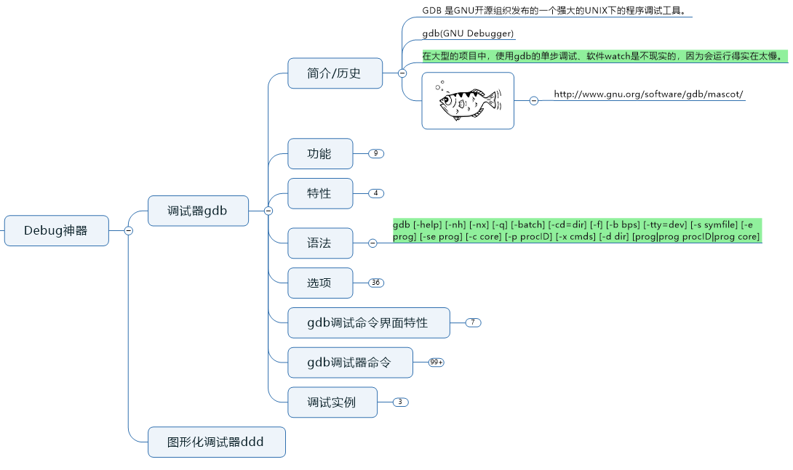
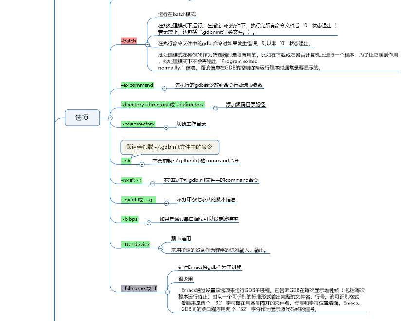

# gdb学习笔记

```
Something I hope you know before go into the coding~
First, please watch or star this repo, I'll be more happy if you follow me.
Bug report, questions and discussion are welcome, you can post an issue or pull a request.
```

## 相关站点

* <https://yifengyou.gitbooks.io/learn-gdbddd/content/>
* <https://github.com/yifengyou/learn-gdbddd/>

## 思维导图





## 参考书籍


## 目录

# gdb小技巧

- [gdb小技巧](#gdb小技巧)   
   - [信息显示](#信息显示)   
      - [gdb版本信息](#gdb版本信息)   
      - [gdb许可证显示](#gdb许可证显示)   
   - [函数](#函数)   
      - [罗列所有函数](#罗列所有函数)   
   - [变量](#变量)   
      - [罗列所有全局/静态变量](#罗列所有全局静态变量)   
   - [断点](#断点)   
   - [观察点](#观察点)   
   - [捕获点](#捕获点)   
   - [打印显示信息](#打印显示信息)   
   - [多进程/多线程](#多进程多线程)   
   - [core dump文件](#core-dump文件)   
   - [汇编](#汇编)   
   - [改变程序执行](#改变程序执行)   
   - [信号](#信号)   
   - [共享库](#共享库)   
   - [脚本](#脚本)   
   - [源文件](#源文件)   
   - [图形化界面显示](#图形化界面显示)   
   - [其他](#其他)   

参考:

* [100个gdb小技巧GitBook](https://wizardforcel.gitbooks.io/100-gdb-tips/content/)
- [100个gdb小技巧GitHub](https://github.com/hellogcc/100-gdb-tips)
- [GDB在线手册](https://sourceware.org/gdb/onlinedocs/gdb)
- [GDB命令卡片](https://github.com/hellogcc/100-gdb-tips/blob/master/refcard.pdf)
- [GDB dashboard](https://github.com/cyrus-and/gdb-dashboard)
- [Gdbinit for OS X, iOS and others - x86, x86_64 and ARM](https://github.com/gdbinit/Gdbinit)
- [dotgdb：关于底层调试和反向工程的gdb脚本集](https://github.com/dholm/dotgdb)


授权许可通告：
```
100个gdb小技巧 官方文档，使用的是GNU Free Documentation License。
```


## 信息显示

### gdb版本信息

```
show version -- Show what version of GDB this is
```

```
(gdb) show version
GNU gdb (GDB) Red Hat Enterprise Linux 8.2-18.el8
Copyright (C) 2018 Free Software Foundation, Inc.
License GPLv3+: GNU GPL version 3 or later <http://gnu.org/licenses/gpl.html>
This is free software: you are free to change and redistribute it.
There is NO WARRANTY, to the extent permitted by law.
Type "show copying" and "show warranty" for details.
This GDB was configured as "x86_64-redhat-linux-gnu".
Type "show configuration" for configuration details.
For bug reporting instructions, please see:
<http://www.gnu.org/software/gdb/bugs/>.
Find the GDB manual and other documentation resources online at:
    <http://www.gnu.org/software/gdb/documentation/>.

For help, type "help".
Type "apropos word" to search for commands related to "word".
(gdb)
```

### gdb许可证显示

```
show copying -- Conditions for redistributing copies of GDB
```

```
(gdb) show copying    
                    GNU GENERAL PUBLIC LICENSE
                       Version 3, 29 June 2007

 Copyright (C) 2007 Free Software Foundation, Inc. <http://fsf.org/>
 Everyone is permitted to copy and distribute verbatim copies
 of this license document, but changing it is not allowed.

                            Preamble

  The GNU General Public License is a free, copyleft license for
software and other kinds of works.

....省略一亿个单词

  Later license versions may give you additional or different
permissions.  However, no additional obligations are imposed on any
author or copyright holder as a result of your choosing to follow a
later version.
```

## 函数

### 罗列所有函数

```
info functions  # 罗列全部
info functions [REGX] # 模糊搜索
```

```
(gdb) info functions
All defined functions:

File main.c:
3:	int add(int, int);
8:	int main();

Non-debugging symbols:
0x0000000000400468  _init
0x00000000004004a0  printf@plt
0x00000000004004b0  .annobin_elf_init.c.exit
0x00000000004004b0  .annobin_elf_init.c.hot
0x00000000004004b0  .annobin_elf_init.c.startup
0x00000000004004b0  .annobin_elf_init.c.unlikely
0x00000000004004b0  .annobin_elf_init.c_end.exit
```

如果不带调试信息，则

```
(gdb) info functions
All defined functions:

Non-debugging symbols:
0x00000000004004a0  printf@plt
(gdb)
```

## 变量

### 罗列所有全局/静态变量

```
info variables # 显示全部
info variables [REGEX] # 模糊搜索
```

```
(gdb) info variables
All defined variables:

File main.c:
3:	int result;

Non-debugging symbols:
0x0000000000400678  _IO_stdin_used
0x0000000000400680  __dso_handle
0x000000000040068c  __GNU_EH_FRAME_HDR
0x00000000004007d4  __FRAME_END__
0x0000000000600e00  __frame_dummy_init_array_entry
0x0000000000600e00  __init_array_start
0x0000000000600e08  __do_global_dtors_aux_fini_array_entry
0x0000000000600e08  __init_array_end
0x0000000000600e10  _DYNAMIC
0x0000000000601000  _GLOBAL_OFFSET_TABLE_
0x0000000000601020  __data_start
0x0000000000601020  data_start
0x0000000000601024  __bss_start
0x0000000000601024  _edata
0x0000000000601024  completed
0x0000000000601028  __TMC_END__
0x0000000000601030  _end
```


## 断点

## 观察点

## 捕获点

## 打印显示信息

## 多进程/多线程

## core dump文件


## 汇编


## 改变程序执行


## 信号


## 共享库

## 脚本


## 源文件

## 图形化界面显示

## 其他


---
